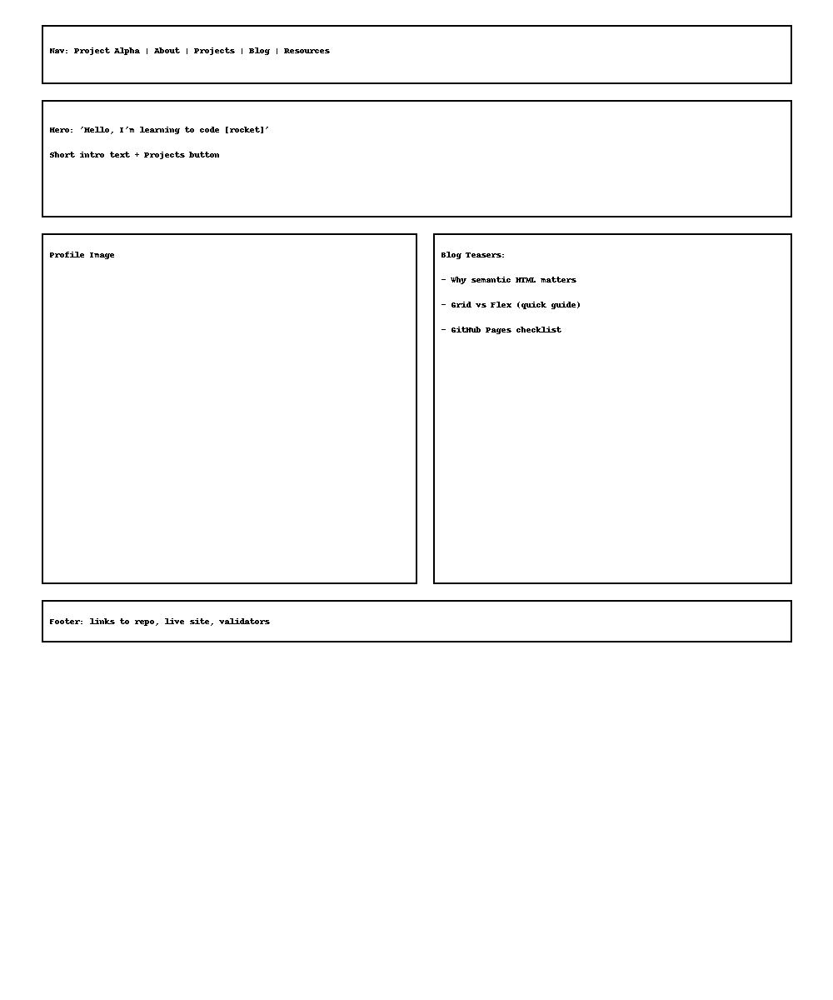

# Project Alpha (Block 1): Multi-Page Static Website

This project is my first multi-page website built for **CIS-376 Web Development** at the University of North Alabama. The goal was to practice semantic HTML, responsive CSS (Grid/Flex), and a small bit of JavaScript, then deploy it with GitHub Pages.

---

## 🔗 Live Links
- **Live Site:** [https://Dtimothy333.github.io/project-alpha/](https://Dtimothy333.github.io/project-alpha/)
- **Repo:** [https://github.com/Dtimothy333/project-alpha](https://github.com/Dtimothy333/project-alpha)
- **Nu HTML Validator:** [Nu Report](https://validator.w3.org/nu/?doc=https%3A%2F%2FDtimothy333.github.io%2Fproject-alpha%2F)
- **WAVE Report:** [WAVE Report](https://wave.webaim.org/report#/https://Dtimothy333.github.io/project-alpha/)

---

## 📄 Pages
- **Home (index.html):** hero section + quick teasers for About and Blog  
- **About:** profile card (image + text about me as a UNA senior)  
- **Projects:** 3 simple project placeholders with thumbnails  
- **Blog:** 3 short entries (semantic HTML, Flex vs Grid, importance of GitHub)  
- **Resources:** curated list of beginner dev links (W3Schools, MDN, GitHub Pages)  

Here’s the homepage wireframe 

Global navigation and footer are on every page.